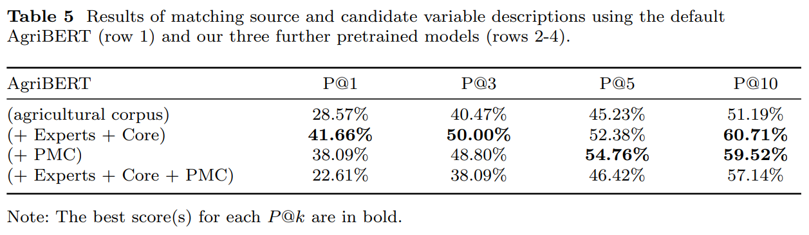

# Adapting BERT and AgriBERT for Agroecology: A Small-Corpus Pretraining Approach

## 🧠 Abstract
This repository presents our second contribution to the task of **Matching Agroecological Experiment Variables (MAEVa-v1.5)**. In this work, we adapt general-purpose language models—**BERT** and **AgriBERT**—to the agroecology domain using a small corpus (less than 100 MB) for continued pretraining.

Our results demonstrate that even with a small corpus, it is possible to adapt these models **without the need for fine-tuning**, resulting in significant savings in time, computational resources, and energy. This makes the approach highly practical for resource-limited environments.

For more information, please refer to our paper:  
**"Adapting BERT and AgriBERT for Agroecology: A Small-Corpus Pretraining Approach"**.

This repository aims to:
- Provide lightweight, domain-specific models for agroecology;
- Share curated corpora suitable for agroecology domain adaptation;
- Offer code and benchmarks to support reproducible research.


## 🪜 Step-by-Step Workflow

The first step of our work is the **collection of domain-specific corpora**, followed by the use of these corpora to **further pretrain BERT and AgriBERT** models.  

The image below illustrates the two main phases of our workflow:  
1. **Corpora Preparation**  
2. **Further Pretraining of BERT and AgriBERT**


## 🔍 Detailed Steps with Explanations and Code

Before executing any command, you should install the requirements using the following command:

```bash
pip install -r requirements.txt
```
### 📂 1️⃣ Corpora Preparation

The image above illustrates the complete process of collecting our corpora used for further pretraining of **BERT** and **AgriBERT** models.

The process begins with the collection of **78 full-text articles** provided by three domain experts in agroecology. Additionally, we retrieved more articles using two public APIs based on predefined queries:

- **Core API**: retrieved **1,666** full-text articles.
- **Europe PMC API**: retrieved **2,831** full-text articles.


#### 📥 API Usage

**Core API:**

- ▶️ With default parameters:
```bash
python "scripts/corpora preparation/core_api.py" --api_key "Your Core API key"
```

- ▶️ With custom options:
```bash
python "scripts/corpora preparation/core_api.py" \
  --api_key "Your Core API key" \
  --query_file "Text file path containing search queries, with one query per line" \
  --output_dir "Folder path to save the returned PDF articles"
```

**Europe PMC API:**

- ▶️ With default parameters:
```bash
python "scripts/corpora preparation/europe_pmc_api.py"
```

- ▶️ With custom options:
```bash
python "scripts/corpora preparation/europe_pmc_api.py" \
  --output_dir "Folder path to save the returned PDF articles" \
  --keywords_file "Text file path containing search queries, with one query per line" \
  --max_downloads "Maximum number of PDF articles to download"
```


#### 📑 PDF to Clean Text Extraction

After collecting the PDF articles, we used [**GROBID**](https://github.com/kermitt2/grobid) (GeneRation Of BIbliographic Data) to extract, parse, and restructure the raw PDFs into **XML/TEI-encoded** documents. These structured files segment the content into meaningful sections (e.g., introduction, methods, conclusion), facilitating further preprocessing.

To ensure clean and unbiased content, we removed the following (non-exhaustive list):
- Author affiliations  
- Corresponding author details  
- Page numbers  
- Inline references  

Each PDF file was then converted into a corresponding `.txt` file containing **only the essential content**, excluding tables, figures, and metadata. These were merged into three distinct corpora:

- **Corpus (Experts)**: 78 TXT files from expert-gathered articles  
- **Corpus (Core)**: 1,666 TXT files retrieved using Core API  
- **Corpus (PMC)**: 2,831 TXT files retrieved using Europe PMC API

> ⚠️ **Note:** [**GROBID**](https://github.com/kermitt2/grobid) must be installed and running for the following scripts to work.


#### 🧾 GROBID Usage

- ▶️ With default parameters:
```bash
python "scripts/corpora preparation/GROBID.py"
```

- ▶️ With custom options:
```bash
python "scripts/corpora preparation/GROBID.py" \
  --pdf_dir "Directory path to the returned PDF articles" \
  --xml_dir "Directory path to store XML/TEI files extracted from PDF articles" \
  --txt_dir "Directory path to store extracted text files from XML/TEI files" \
  --corpus_file "TXT file path to store the merged text files as the final corpus" \
  --grobid_url "http://localhost:8070/api/processFulltextDocument"
```

---

### 2️⃣ Further Pretraining: BERT and AgriBERT

We further pretrained two language models on our agroecological corpora using the **Masked Language Modeling (MLM)** task:

- [`bert-base-uncased`](https://huggingface.co/google-bert/bert-base-uncased) 
- [`agriculture-bert-uncased`](https://huggingface.co/recobo/agriculture-bert-uncased)

Both models were pretrained for **20 epochs** with:
- Batch size: **64**
- Sequence length: **512**
- MLM probability: **15%**
- Same hyperparameters as used in the checkponit '[`bert-base-uncased`](https://huggingface.co/google-bert/bert-base-uncased)'


#### ⚙️ How to Run the further pretraining Code

You can use our script to further pretrain PLMs on the MLM task on **any corpus**. By default, it uses the [`agriculture-bert-uncased`](https://huggingface.co/recobo/agriculture-bert-uncased) checkpoint and the **Corpus (PMC)**.

To download the model weights, make sure you're logged into your HuggingFace account. You can log in using the following command:

```bash
huggingface-cli login
```


##### ▶️ With Default Parameters
```bash
python "scripts/Further pretraining/further_pretraining.py"
```

##### ▶️ With Custom Options
```bash
python "scripts/Further pretraining/further_pretraining.py" \
  --corpus_path "Path to the TXT corpus file to be used for further pretraining" \
  --checkpoint recobo/agriculture-bert-uncased \
  --save_dir "Directory path to save the final further pretrained model weights and tokenizer" \
  --epochs 20 \
  --batch_size 64 \
  --accumulation_steps 4 \
  --lr 5e-5 \
  --mlm_prob 0.15
```

---

#### 🧪 Our Best Pretrained Models for Scientific Research

The tables below present the performance of our pretrained models using different corpora, and compare them with the original baseline models. As illustrated, our best-performing models are:

- **BERT-base (+ PMC): BERT-base model further pretrained on the Corpus (PMC)**
- **AgriBERT (+ Experts + Core): AgriBERT model further pretrained on the Corpus (Experts + Core)**

These pretrained models are made available for **scientific research purposes**. They are suitable for:
- Agroecological NLP tasks
- Further pretraining
- Fine-tuning for agroecology domain-specific applications

---

📊 **Model Comparison Results**




---

### 🔁 How to Reproduce Our Best Results

Before running the commands to reproduce our results, make sure to download the model weights using the following commands:

```bash
sudo apt-get install git-lfs
git lfs pull
```

---

#### Using **BERT-base (+ PMC)**

##### ▶️ With Default Parameters
```bash
python "scripts/matching_variables/our_pretrained_BERT-base.py"
```

##### ▶️ With Custom Options
```bash
python "scripts/matching_variables/our_pretrained_BERT-base.py" \
  --model_path "Path to the weights and tokenizer of the model" \
  --source_file "Path to source descriptions file (.txt)" \
  --candidate_file "Path to candidate descriptions file (.txt)" \
  --validation_file "Path to Excel file with ground-truth correspondences" \
  --output_results "Path to save top-k matching results (.xlsx)" \
  --output_validation "Path to save validation results (.xlsx)"
```

---

#### Using **AgriBERT (+ Experts + Core)**

##### ▶️ With Default Parameters
```bash
python "scripts/matching_variables/our_pretrained_AgriBERT.py"
```

##### ▶️ With Custom Options
```bash
python "scripts/matching_variables/our_pretrained_AgriBERT.py" \
  --model_path "Path to the weights and tokenizer of the model" \
  --source_file "Path to source descriptions file (.txt)" \
  --candidate_file "Path to candidate descriptions file (.txt)" \
  --validation_file "Path to Excel file with ground-truth correspondences" \
  --output_results "Path to save top-k matching results (.xlsx)" \
  --output_validation "Path to save validation results (.xlsx)"
```

---

# 📬 Contact

If you have any questions, encounter issues with the code, or would like to know more about our work, please contact the corresponding author:  
📧 [oussama.mechhour.cirad@gmail.com](mailto:oussama.mechhour.cirad@gmail.com)
[LinkedIn](https://www.linkedin.com/in/oussama-mechhour-ph-d-student-31a94323a/)


